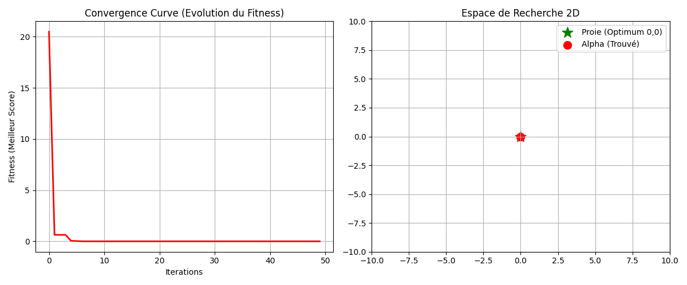

# Grey Wolf Optimizer (GWO) - Python Implementation 🐺


## 📄 Description

Ce projet est une implémentation complète en **Python** de l'algorithme d'optimisation **Grey Wolf Optimizer (GWO)**.

Le GWO est une métaheuristique inspirée de la nature qui imite le comportement de chasse et la hiérarchie sociale des loups gris (Canis lupus). Ce code résout des problèmes d'optimisation complexes sans avoir besoin de calculs de gradients.

### ✨ Fonctionnalités
* **Approche Orientée Objet (OOP) :** Code modulaire et facilement extensible.
* **Visualisation :** Génération automatique de courbes de convergence et de graphiques 2D.
* **Zéro Dataset requis :** L'algorithme optimise une fonction mathématique (Fonction Sphère), démontrant sa capacité de convergence autonome.
* **Hiérarchie Dynamique :** Implémentation fidèle des rôles Alpha, Beta et Delta.

## 🛠️ Installation

Pour exécuter ce projet localement, suivez ces étapes :

1. **Cloner le projet**
   ```bash
   git clone https://github.com/emna-kaaniche2003/Grey-Wolf-Optimizer-Python.git
   cd Grey-Wolf-Optimizer-Python

## 📂 Structure du Projet
```text
Grey-Wolf-Optimizer-Python/
│
├── main.py             # Le code source complet (Algorithme + Visualisation)
├── requirements.txt    # Liste des librairies nécessaires
└── README.md           # Documentation du projet
```

## 🚀 Utilisation

### Résultat attendu

Le script va afficher la progression de la "chasse" dans le terminal :

```text
🚀 Démarrage de GWO sur 2 dimensions...
Iteration 0: Best Fitness = 154.23
...
Iteration 50: Best Fitness = 0.00004
✅ Optimisation terminée.
```


